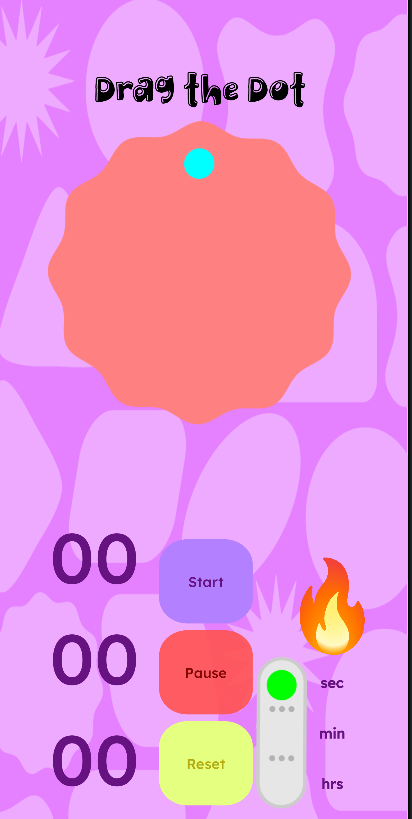
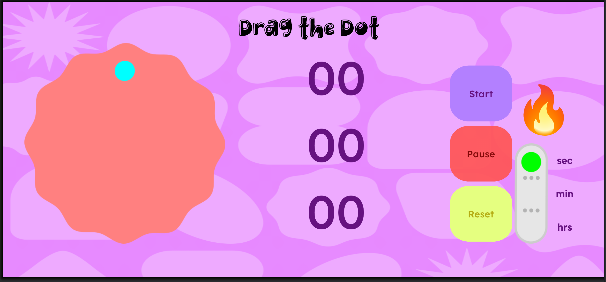

# Tickt — Spin-to-Set Timer (Android) ⏱️

*Set timers by dragging a dot around a dial — tactile, visual and delightfully simple.*

---

## 📸 Demo Screenshots

 


---

## 📚 Table of Contents

1.  [What is Tickt](#-what-is-tickt)
2.  [Features](#-features)
3.  [Quick Start](#-quick-start)
4.  [Project Layout](#-project-layout)
5.  [Required Assets](#-required-assets)
6.  [Permissions](#-permissions)
7.  [How It Works](#️-how-it-works-high-level)
8.  [Customization & Dev Notes](#-customization--dev-notes)
9.  [Troubleshooting](#️-troubleshooting)
10. [Contributing](#-contributing)
11. [License](#-license)

---

## 💡 What is Tickt

**Tickt** is an Android timer/alarm app that uses a drag-to-set dial UX. The user rotates a dot around a wobbly clock body to set seconds, minutes, or hours. The app demonstrates touch math, smooth animations, haptics, sound, foreground `Service` usage, and notifications.

---

## ✨ Features

* **Spin-to-set dial** (sec / min / hrs modes).
* Smooth angle → value mapping with clamping and anti-backtracking rules.
* Short **tick sound + soft vibration** while winding the dial.
* Foreground `TimerService` showing a persistent notification while running.
* When finished in the background: plays alarm tune + shows a non-persistent "finished" notification in sync.
* Splash screen with rotating body + fade in/out animations.
* Landscape layout and night mode resource support.
* **Min SDK 24**, tested up to target/compile SDK 36.

---

## 🚀 Quick Start

### Clone & Run from Command Line

```bash
# Clone the repository
git clone https://github.com/Aouni19/Tickt.git

# Navigate to the project directory
cd tickt

# Build the debug APK
./gradlew assembleDebug

# Install on a connected device
./gradlew installDebug


```

---

## 📂 Project Layout
```bash
app/
  src/main/
    java/com/example/clocky/     # Kotlin source (MainActivity, Splash, TimerService, App)
    res/
      layout/                    # activity_main.xml
      layout-land/               # Landscape variant
      layout/activity_splash.xml # Splash screen layout
      drawable/                  # body.png, hand.png, toggles...
      raw/                       # tick_wind.wav, alarm_tune.mp3 (YOU MUST ADD)
      values/                    # colors.xml, strings.xml, themes.xml
    AndroidManifest.xml
```

## ⚙️ How It Works (High Level)

### Dial Interaction

Convert touch coordinates (x, y) → vector from dial center → atan2(dy, dx) → degrees with 0° at 12 o'clock (clockwise positive).

Map degrees to units:

Seconds/Minutes: 6° = 1 unit (60 units per revolution).

Hours: 30° = 1 unit (12 major nodes); hours show full count (0-99) mapped modulo 12 for the angle.

Dragging clockwise increments the value; anti-clockwise decrements. When the timer is at 00:00:00, anti-clockwise movement is ignored.

### Timer & Service

TimerService runs as a foreground service while the timer is active, posting an ongoing notification with a progress bar and remaining time.

Every tick, an ACTION_TICK broadcast updates MainActivity when it's visible.

If the timer finishes while the app is backgrounded:

The service posts a non-persistent "finished" notification and starts MediaPlayer to play alarm_tune.mp3.

When the tune completes, the service cancels the notification and stops itself.

If the app is in the foreground when the timer finishes, the service does not play the alarm or create the "finished" notification.

### Haptics & Sound

Winding: SoundPool plays tick_wind.wav and Vibrator.vibrate() emits a very short, soft pulse at each unit step.

Countdown: A tick sound is not played during the countdown (by design).


## 🛠️ Troubleshooting

### Unresolved resources / R errors

* Go to Build → Clean Project.

* Then, Build → Rebuild Project.

* If errors persist: File → Invalidate Caches / Restart.

### Duplicate dependency (Guava / listenablefuture)

Add the following resolution strategy to your app-level build.gradle file:
Gradle

```bash

configurations.all {
  resolutionStrategy {
    force("com.google.guava:listenablefuture:9999.0-empty-to-avoid-conflict")
  }
}
```

* Notification not showing on emulator

* Use a Google Play emulator image or test on a physical device. Ensure the notification channel is created before posting notifications.

* Audio silence due to DND

* Ask the user to grant Notification Policy Access if you want the alarm to bypass the Do Not Disturb setting.


## Roadmap

  * Add Pause/Resume/Stop actions to the notification.

  * Multi-timer support + persistent storage.

  * Improved accessibility (TalkBack labels, larger hit targets).

  * User-selectable custom tones + volume controls.

## 📬 Contact

* Created with ❤️ by Aoun Raza

* Report issues or feature requests at: https://github.com/Aouni19/Tickt/issues
